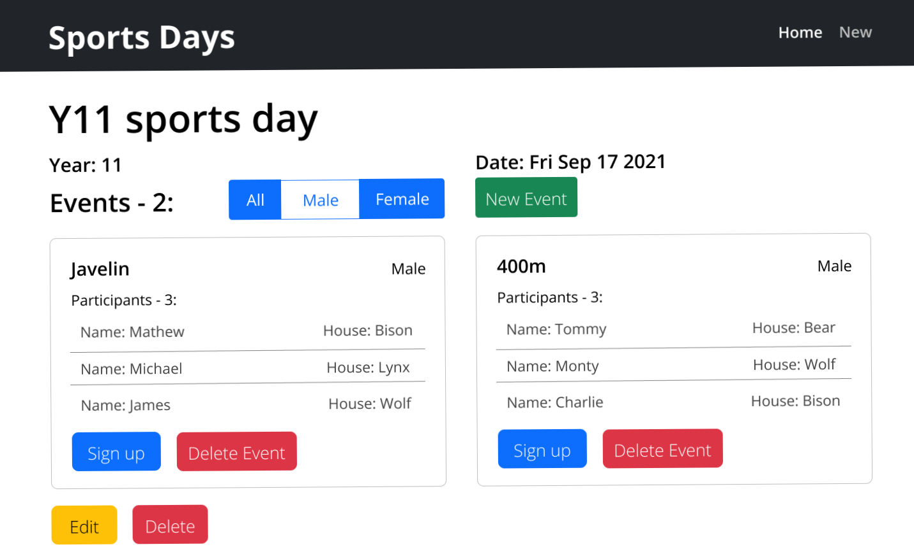

# Sports day organiser

A comprehensive web application built for organising and signing up for sports days.

The project was built as an individual school project in consultation with a user. A comprehensive design document with design sketches, rationale and much more was made during the build process (synthesised in this README).

## 📔 Design Sketches
My user interface design sketches were created using figma, a popular website for creating web and desktop app design sketches.
<p align="center"></p>
Home page (logged in as admin user)

<details>
<summary>See More Images</summary>

<p align="center"></p>

Home page (not logged in)

<p align="center"></p>

Original sports day show page design

<p align="center"></p>

Final sports day show page design (logged in as admin user)<br>After user consultation, legal GDPR requirements of only showing students their own data, as well as displaying and enforcing participant limits per house were brought to my attention, prompting changes in design

<p align="center"></p>

Original new sports day page design (only accessible by admin)

<p align="center"></p>

Final new sports day page design (only accessible by admin)<br>Based upon user feedback, suggesting that the app may be used on small screen sizes, the table layout was redesigned into a more responsive card layout

<p align="center"></p>

Original event show page design

<p align="center"></p>

Final event show page design (logged in as admin user)

<p align="center"></p>

Final event show page design (logged in as student)

The initial design proposed a login system only for admin users for permission purposes, however after legal requirements were considered, a login system for both students and teachers was designed

<p align="center"></p>

Application database relationship diagram

</details>

## 🖼️ Project Images & Walkthrough video

Project overview/walkthrough video:

https://user-images.githubusercontent.com/81182728/187048148-d8939812-b0c6-4056-8c01-ebbcb081419b.mp4

## 🚀 Future Scope

I may decide to add some of the following features in the future:
- ℹ️ Application home page with explanation of the application functionality as well as contact details could be added
- 📝 Export sports day to Excel or CSV file functionality. App should create spreadsheet including students names, houses...
- ⏱️ Scoring of sports day events
- 🎨 Alternative color schemes

## 🏁 Getting Started

These instructions will get you a copy of the project up and running on your local machine for development and testing purposes.

### Prerequisites

You must have node, npm, MongoDB and a browser downloaded. To be able to run the website, first you need to install the required dependencies with:

```
npm install 
```

### Running the project

You must first set up a master password using: 

```
node setup.js
```
This creates a hidden .env file, which stores the master password hashed and salted. 
To run the website you need to run the server using node:

```
node server.js
```
Messages verifying successful connection to the database and connection to localhost should be displayed. Then navigate to the website in the browser. Type the following url into the browser:

```
http://localhost:3000/
```
The website should be served to you by the server to view and use. You may also wish to seed the database with template events and some sports days: 

```
node seeds.js
```


## ⛏️ Built With

- [JavaScript](https://developer.mozilla.org/en-US/docs/Web/JavaScript) - Programming language
- [NodeJS](https://nodejs.org/en/) - JS runtime environment
- [ExpressJS](https://expressjs.com/) - Server
- [EJS](https://ejs.co/) - Javascript templating engine
- [Bootstrap](https://getbootstrap.com/) - Styling
- [CSS](https://developer.mozilla.org/en-US/docs/Web/CSS) - Fancy animal icon buttons using hidden radio buttons
- [Mongoose](https://mongoosejs.com/) - Interface between JS and MongoDB database
- [PassportJS](https://www.passportjs.org/) - Authentication for Node.js
- [Joi](https://joi.dev/) - Server-side data validation
- [Sanitize-html](https://www.npmjs.com/package/sanitize-html) - HTML sanitisation API
- [Bcrypt](https://www.npmjs.com/package/bcrypt) - Password hashing library
- [Dotenv](https://www.npmjs.com/package/dotenv) - Loads environment variables for Node.js

## ✍️ Author

- [JakubRichardson](https://github.com/JakubRichardson)
